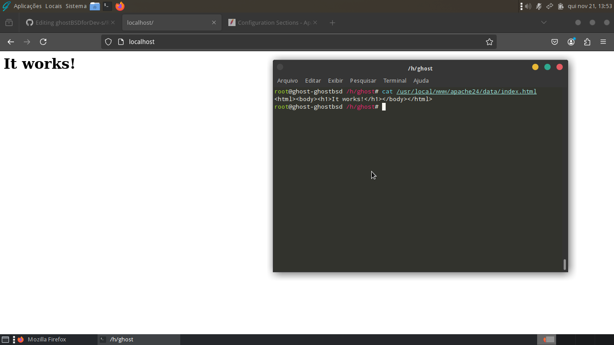

# ghostBSDforDev-s
tip's dev in ghost bsd

## tip 1: install gcc and g++
with root,  
ghost@ghost# pkg install -g 'GhostBSD*-dev'  
ghost@ghost# pkg install gcc

## tip 2: install zsh 
ghost@ghost# pkg install zsh  
ghost@ghost# chsh -s /usr/local/bin/zsh   or  
ghost@ghost# chsh zsh   
após alterar com chsh, reinicie seu sistema

## tip 3: install apache2
ghost@ghost#  pkg install apache24-2.4.62   
ghost@ghost#  vim /usr/local/www/apache24/data/index.html   <- index  
ghost@ghost#  vim /usr/local/etc/apache24/httpd.conf        <- config file  

